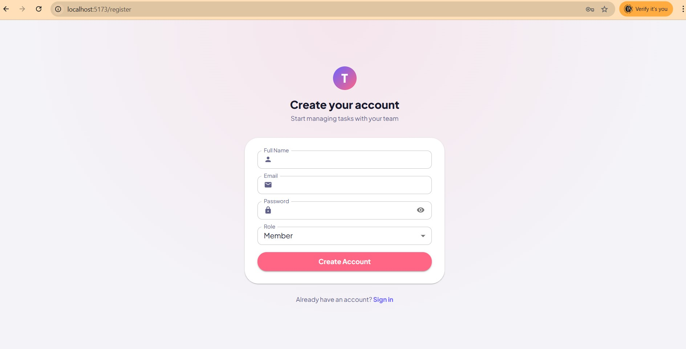
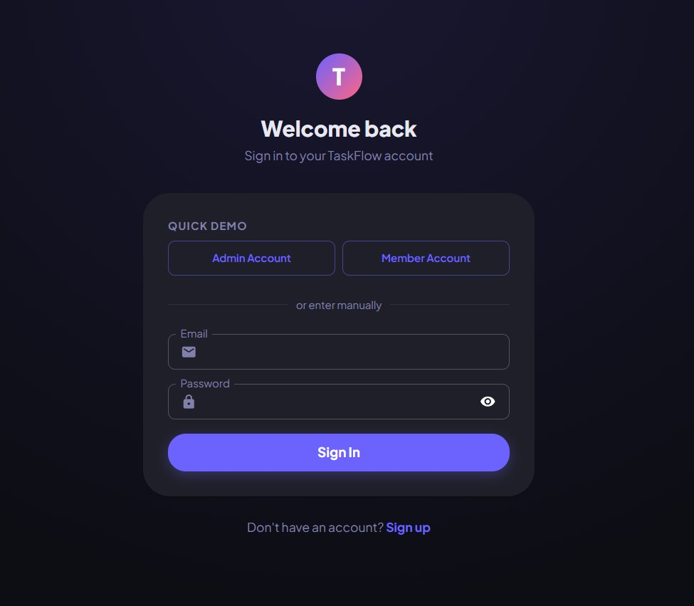
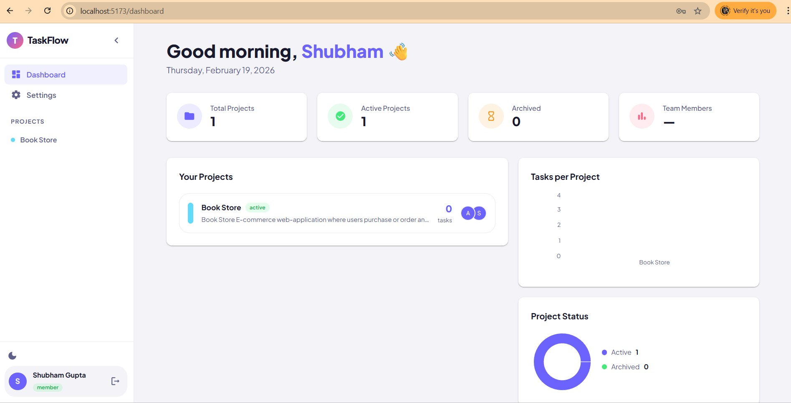
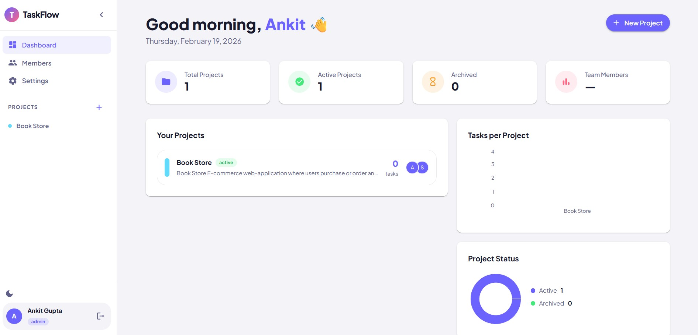

# TaskFlow — Team Task Management System

A production-grade, full-stack team task management system built with the MERN stack. Like Trello/Notion Lite, with JWT authentication, role-based access, Kanban boards, comments, file uploads, and more.

------------------------------------------------------------------------------------------------

🔗 Live Demo  

🌐 Project Link: https://taskflow-projectmanagement.vercel.app/login

-------------------------------------------------------------------------------------------------

## 📸 ScreenShots

### Sign-Up


### Login 


### Homepage


### Admin Dashboard


------------------------------------------------------------------------------------------------

## ✨ Features

- 🔐 **JWT Authentication** — Access + refresh token rotation with auto-refresh
- 👥 **Role-Based Access** — Admin and Member roles with fine-grained permissions
- 📋 **Kanban Boards** — Drag-and-drop task management across columns
- ✅ **Task Management** — Full CRUD with priority, due dates, labels, assignees
- 💬 **Comments** — Threaded comments on tasks with edit/delete
- 📊 **Activity Log** — Full audit trail of project activity
- 📎 **File Uploads** — Cloudinary-backed file attachments on tasks
- 🔍 **Pagination & Filtering** — Server-side filtering by status, priority, assignee
- 👥 **Member Invitations** — Add/remove project members by email
- 📈 **Dashboard** — Charts and project overview with Recharts
- 🌙 **Dark/Light Theme** — Persistent user theme preference

--------------------------------------------------------------------------

## 🛠 Tech Stack

| Layer        | Technology                              |
|-------------|-----------------------------------------|
| Frontend     | React 18 + Vite + Material UI v5        |
| State        | Zustand (client) + React Query v5 (server) |
| Backend      | Node.js + Express                       |
| Database     | MongoDB + Mongoose                      |
| Auth         | JWT (access + refresh) + bcryptjs       |
| File Storage | Cloudinary + Multer                     |
| Deployment   | Vercel (frontend) + Render (backend)    |

--------------------------------------------------------------------------

## 🚀 Getting Started

### 1. Clone the repo
```bash
Frontend: git clone https://github.com/Anii1445/taskflow-frontend.git
cd frontend

Backend: git clone https://github.com/Anii1445/taskflow-backend.git
cd backend

### 2. Set up the Backend
```bash
cd backend
npm install
cp .env.example .env
# Edit .env with your MongoDB URI, JWT secrets, Cloudinary credentials
npm run dev
```

### 3. Set up the Frontend
```bash
cd frontend
npm install
cp .env.example .env
# .env already points to http://localhost:5000/api
npm run dev
```

run seed

## 📁 Project Structure

taskflow/
├── backend/
│   ├── src/
│   │   ├── config/         # DB + Cloudinary setup
│   │   ├── controllers/    # Route handlers
│   │   ├── middleware/     # Auth, roles, upload, errors
│   │   ├── models/         # Mongoose schemas
│   │   ├── routes/         # Express routers
│   │   └── utils/          # Tokens, responses, logger, seed
│   └── server.js
└── frontend/
    └── src/
        ├── api/            # Axios instance + service functions
        ├── components/     # Reusable UI components
        ├── hooks/          # React Query hooks
        ├── pages/          # Route-level page components
        ├── store/          # Zustand stores
        └── theme/          # MUI theme configuration

--------------------------------------------------------------

## 🌐 API Reference

### Auth
| Method | Endpoint           | Access  |
|--------|--------------------|---------|
| POST   | /api/auth/register | Public  |
| POST   | /api/auth/login    | Public  |
| POST   | /api/auth/refresh  | Public  |
| POST   | /api/auth/logout   | JWT     |
| GET    | /api/auth/me       | JWT     |

### Projects
| Method | Endpoint                         | Access       |
|--------|----------------------------------|--------------|
| GET    | /api/projects                    | JWT          |
| POST   | /api/projects                    | JWT          |
| GET    | /api/projects/:id                | JWT (member) |
| PUT    | /api/projects/:id                | Admin/Owner  |
| DELETE | /api/projects/:id                | Admin/Owner  |
| POST   | /api/projects/:id/members        | Admin/Owner  |
| DELETE | /api/projects/:id/members/:uid   | Admin/Owner  |
| GET    | /api/projects/:id/activity       | JWT (member) |

### Tasks
| Method | Endpoint                                    | Access      |
|--------|---------------------------------------------|-------------|
| GET    | /api/projects/:pId/tasks                    | JWT (member)|
| POST   | /api/projects/:pId/tasks                    | JWT (member)|
| GET    | /api/projects/:pId/tasks/:tId               | JWT (member)|
| PATCH  | /api/projects/:pId/tasks/:tId               | JWT (member)|
| DELETE | /api/projects/:pId/tasks/:tId               | Admin/Owner |
| PATCH  | /api/projects/:pId/tasks/reorder            | JWT (member)|
| POST   | /api/projects/:pId/tasks/:tId/upload        | JWT (member)|

-----------------------------------------------------------------------------------

## 🚀 Deployment

### Frontend → Vercel
1. Push `frontend/` to GitHub
2. Import to [vercel.com](https://vercel.com)
3. Set `VITE_API_URL=https://your-backend.onrender.com/api`
4. Deploy

### Backend → Render
1. Push `backend/` to GitHub
2. Create new Web Service on [render.com](https://render.com)
3. Build command: `npm install`
4. Start command: `npm start`
5. Add all environment variables from `.env.example`
6. Deploy

-----------------------------------------------------------------------

## 🔒 Security Features

- JWT access tokens (15m) + refresh tokens (7d) with rotation
- bcrypt password hashing (12 rounds)
- Rate limiting on all API routes (100 req/15min)
- Stricter auth rate limit (20 req/15min)
- MongoDB query sanitization (express-mongo-sanitize)
- Security headers (helmet.js)
- CORS configured for specific origins only
- Input validation with Joi


